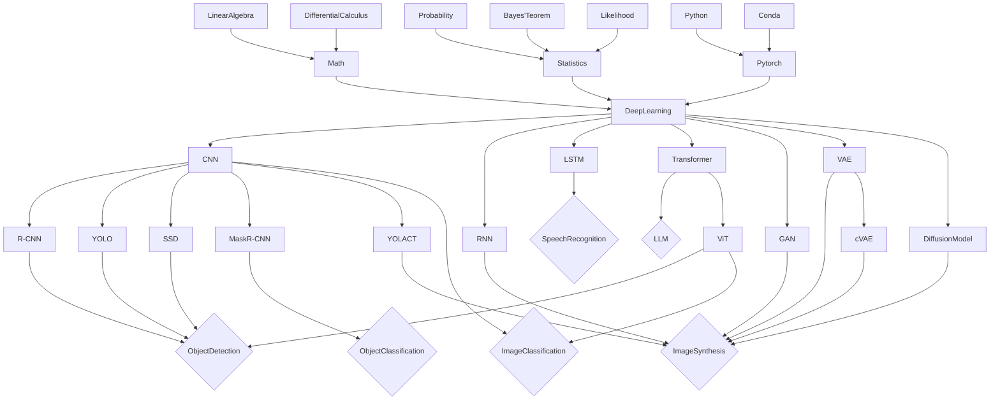

```mermaid
flowchart TD
    LinearAlgebra --> Math
    DifferentialCalculus -->Math

    Probability --> Statistics
    Bayes'Teorem --> Statistics
    Likelihood --> Statistics

    Math --> DeepLearning
    Statistics --> DeepLearning

    Python --> Pytorch
    Conda --> Pytorch
    Pytorch --> DeepLearning

    DeepLearning --> CNN
    DeepLearning --> RNN
    DeepLearning --> LSTM
    DeepLearning --> Transformer
    DeepLearning --> GAN
    DeepLearning --> VAE
    DeepLearning --> DiffusionModel

    CNN --> R-CNN
    CNN --> YOLO
    CNN --> SSD
    CNN --> MaskR-CNN
    CNN --> YOLACT

    OD{ObjectDetection}
    IS{InstanceSegmentation}
    OC{ObjectClassification}
    LLM{LLM}
    IS{ImageSynthesis}
    IC{ImageClassification}
    SR{SpeechRecognition}

    R-CNN --> OD
    YOLO --> OD
    SSD --> OD
    CNN --> IC
    LSTM --> SR
    Transformer --> LLM
    Transformer --> ViT
    RNN --> IS
    YOLACT --> IS
    MaskR-CNN --> OC
    ViT --> OD
    ViT --> IC
    GAN --> IS
    VAE --> IS
    VAE --> cVAE
    cVAE --> IS
    DiffusionModel --> IS

```