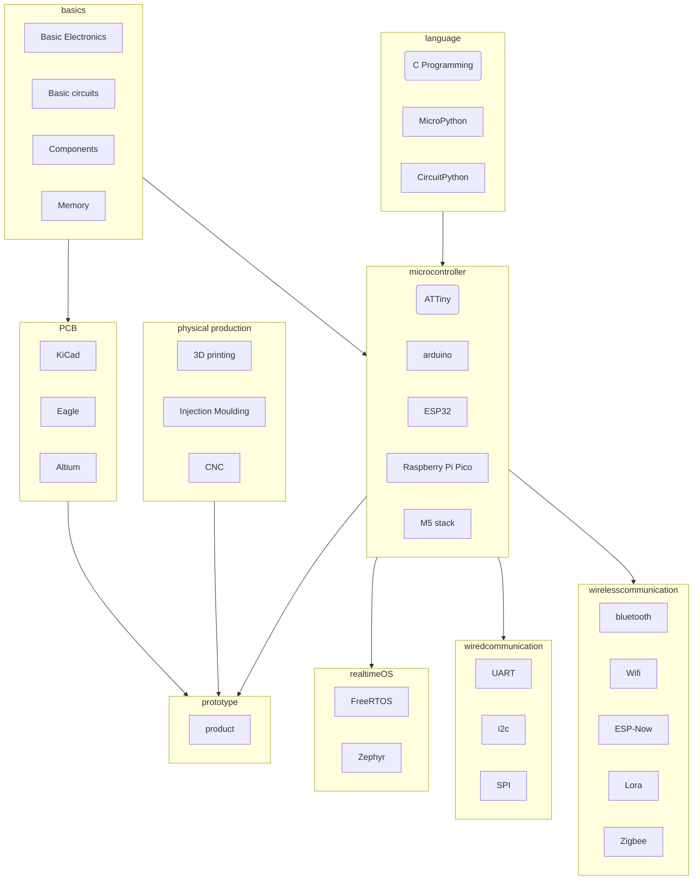

# Microcontrollers and Hardware

```mermaid
flowchart TD

    subgraph basics
        BE[Basic Electronics]
        BC[Basic circuits]
        Components
        Memory
    end

    subgraph PCB
        KiCad
        Eagle
        Altium
    end


    subgraph language
        C(C Programming) 
        MicroPython
        CircuitPython
    end

        subgraph microcontroller
        AT(ATTiny)
        arduino
        ESP32
        pi[Raspberry Pi Pico]
        M5[M5 stack]
    end


    language --> microcontroller

    subgraph prod[physical production]
        3D[3D printing]
        IM[Injection Moulding]
        CNC
    end
    
    
    

    basics --> microcontroller
    basics --> PCB

    microcontroller --> prototype
    prod[physical production] --> prototype
    PCB --> prototype


    microcontroller --> realtimeOS
    microcontroller --> wiredcommunication 
    microcontroller --> wirelesscommunication 

    subgraph realtimeOS
        FreeRTOS
        Zephyr

    end


    subgraph wiredcommunication
        UART
        i2c
        SPI
    end

    subgraph wirelesscommunication
        bluetooth
        Wifi
        ESP-Now
        Lora 
        Zigbee

    end


    subgraph prototype
        product
    end

```